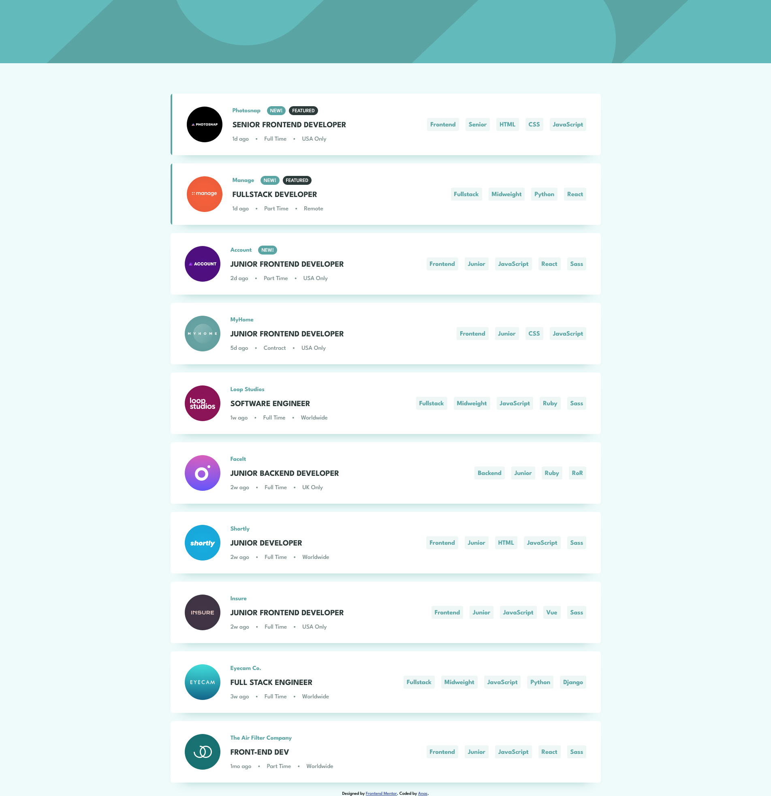

# Frontend Mentor - Job listings with filtering solution

This is a solution to the [Job listings with filtering challenge on Frontend Mentor](https://www.frontendmentor.io/challenges/job-listings-with-filtering-ivstIPCt).

## Table of contents

- [Overview](#overview)
  - [The challenge](#the-challenge)
  - [Screenshot](#screenshot)
  - [Links](#links)
- [My process](#my-process)
  - [Built with](#built-with)
  - [What I learned](#what-i-learned)
  - [Useful resources](#useful-resources)
- [Author](#author)

## Overview

### The challenge

Users should be able to:

- View the optimal layout for the site depending on their device's screen size
- See hover states for all interactive elements on the page
- Filter job listings based on the categories

### Screenshot



### Links

- Solution URL: [https://github.com/anas-cd/Job-listings](https://github.com/anas-cd/Job-listings)
- Live Site URL: [https://anas-cd.github.io/Job-listings/](https://anas-cd.github.io/Job-listings/)

## My process

### Built with

- Semantic HTML5 markup
- SCSS
- Flexbox
- Desktop-first workflow
- Fetch API
- Gulp
- [Vue.js](https://vuejs.org/) - JS Framework

### What I learned

Learned about many things here are the most important onse: 

- Vue.js Transition html element that can be used to make transitions of v-show/v-if smoothly, Note: this doesn't work on components so you need to but them inside the components to take effect, more info about it is linked down below on Useful resources> 
```html
<Transition name="fade">
    ...
</Transition>
```

- Vue.js encapsulates arrays and objects in proxies this solves many things and one of them is the reactivtiy of arrays, the content of that array can be accessed normally but when shown it shows as a proxy, here is how to show the content directly> (this.jobsData is the array) 

```js
console.log(JSON.parse(JSON.stringify(this.jobsData))); 
```

- Checking the filters by checking if all elements of that array is in the job's tags array, here we can see how it works> 
```js
this.filterBar.every(tag => {return this.JobTags.includes(tag)}); 
```

- Including elements of array into another> 
```js
this.arr = [...this.arr1, ...this.arr2, ...this.arr3];
```

### Useful resources

- [Vue.js Transition component](https://vuejs.org/guide/built-ins/transition.html#the-transition-component) - This helped me in using the transition component.

- [Check if Array has all Elements of Another Array - JavaScript](https://bobbyhadz.com/blog/javascript-check-if-array-contains-all-elements-another-array) - How to check if Array has all Elements of Another Array - JavaScript.

- [Vue.js documentation](https://vuejs.org/guide/introduction.html) - Vue.js documentation.


## Author

- Frontend Mentor - [@anas-cd](https://www.frontendmentor.io/profile/anas-cd)
- Twitter - [@AnasCd](https://twitter.com/AnasCd)
